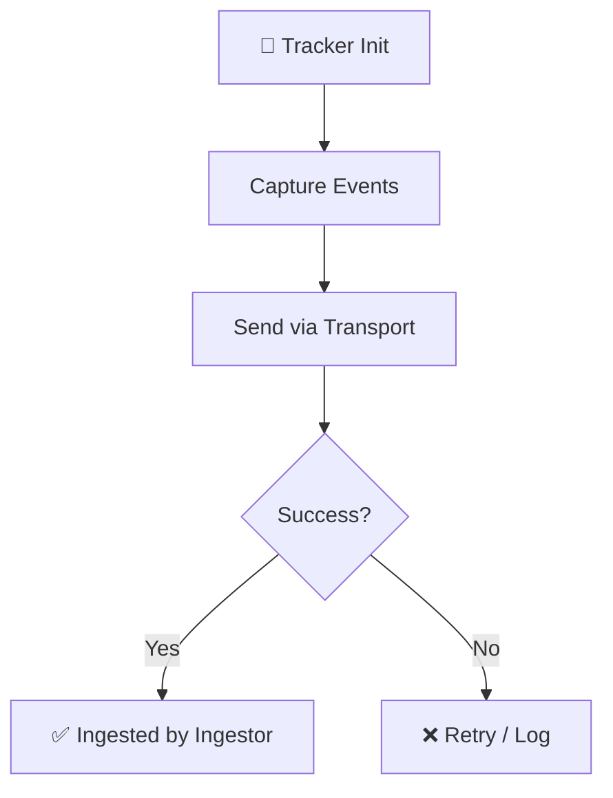

# Rewind Architecture & Getting Started


*Unified, high‑performance session recording for web apps.*

## ⚙️ How It Works


## Description
Rewind is a monorepo powered by **Turborepo** and **pnpm** that captures, ingests, stores, and replays user sessions and DOM events. It provides a tiny, zero‑config JavaScript snippet for your site, a high‑throughput ingestor, a background worker, a REST API, and a sleek Next.js dashboard.

## Features
- ✅ Capture DOM mutations, network requests, console logs, and custom events.  
- ✅ Batch data and transmit via WebSocket with HTTP fallback.  
- ✅ Ingestor offloads payloads to a **BullMQ** queue backed by **Redis**.  
- ✅ Worker processes queue jobs and persists events with **Drizzle ORM** into **PostgreSQL**.  
- ✅ Secure JWT‑based API for dashboard interactions.  
- ✅ Interactive replay UI built with **rrweb‑player**.  
- ✅ Type‑safe shared schema and validators using **Zod** and **TypeScript**.  
- ✅ Fast, production‑ready builds via **esbuild**.

## Tech Stack
- **Node.js** (runtime)  
- **TypeScript** (static typing)  
- **Next.js** (dashboard)  
- **React** + **Tailwind CSS** (UI)  
- **Express** (ingestor)  
- **BullMQ** + **Redis** (queue)  
- **PostgreSQL** + **Drizzle ORM** (database)  
- **rrweb** & **rrweb‑player** (recording & replay)  
- **Zod** (validation)  
- **esbuild** (tracker bundling)

## Installation
### Option A: Local Development (Recommended)
1. **Copy environment variables**  
   ```bash
   cp .env.example .env
   ```
2. **Start the databases** (Postgres & Redis)  
   ```bash
   docker compose up -d
   ```
3. **Push the database schema**  
   ```bash
   pnpm run db:push
   ```
4. **Build the Tracker**  
   ```bash
   cd apps/tracker
   pnpm install
   pnpm run build   # creates dist/tracker.js
   ```
5. **Start all services** (hot‑reloading)  
   ```bash
   pnpm run dev
   ```

### Option B: Production (Single‑Server VPS)
1. **Configure `.env`** on the VPS – use the `postgres` and `redis` hostnames from `.env.example`.  
2. **Build and run containers**  
   ```bash
   docker compose -f docker-compose.prod.yml up --build -d
   ```

You're all set — the service is now running.

## Usage
### Embed the Tracker on Your Site
```html
<script src="http://localhost:3000/tracker.js"></script>
<script>
  // Initialise the tracker with your project token
  window.Rewind.init({
    projectToken: 'your-project-token-here',
    ingestorUrl: 'ws://localhost:3001'
  });
</script>
```

The script is produced by the `build` script in `apps/tracker` and lives in `dist/tracker.js`.  
It automatically captures:

- DOM changes (`rrweb`)  
- Network requests (fetch/XHR) – see `src/capture/network.ts`  
- Console output (`console.log`, `console.error`, etc.) – see `src/capture/console.ts`

## 🧩 System Architecture Diagram
```mermaid
graph TD
    Client[Client Website / Browser] -->|DOM Events + Logs + Network| Tracker
    Tracker[@rewind/tracker] -->|WebSocket / HTTP Batch| Ingestor
    Ingestor[@rewind/ingestor] -->|BullMQ Queue| Redis[(Redis)]
    Redis -->|Queue Jobs| Worker[@rewind/worker]
    Worker -->|Drizzle ORM Inserts| Postgres[(PostgreSQL)]
    
    Dashboard[@rewind/dashboard] -->|Queries| API[@rewind/api]
    Dashboard -->|Direct DB Queries| Postgres
    API -->|Validates JWT & Queries| Postgres
```

## 🏗️ Architecture & Services Overview
### 1. Tracker (`apps/tracker`)
- **What it does:** Vanilla JS snippet embedded on client sites.  
- **How it works:** Uses `rrweb` for DOM capture and overrides `fetch`, `XMLHttpRequest`, and `console` to record network and log events. Batches are sent over WebSocket (or HTTP fallback) to the Ingestor.  
- **Build:** `pnpm run build` creates a minified IIFE bundle (`dist/tracker.js`) via **esbuild**.  
- **Key files:** `src/capture/console.ts`, `src/capture/network.ts`, `build.js`, `.gitignore`.

### 2. Ingestor (`apps/ingestor`)
- **What it does:** High‑throughput entry point for tracker data.  
- **How it works:** Express + WebSocket server authenticates connections, receives batches, and pushes them to a Redis‑backed BullMQ queue.  
- **Port:** `3001`

### 3. Worker (`apps/worker`)
- **What it does:** Background queue processor.  
- **How it works:** Pulls jobs from Redis, transforms raw payloads, and inserts events into PostgreSQL via Drizzle ORM. Scales horizontally.  

### 4. API (`apps/api`)
- **What it does:** Modular REST API for the Dashboard.  
- **How it works:** Controllers (`auth`, `projects`, `sessions`) handle JWT authentication and data queries.  
- **Port:** `3002`

### 5. Dashboard (`apps/dashboard`)
- **What it does:** Main UI built with Next.js 15 and a “Terminal Brutalist” design system.  
- **How it works:** Shows analytics, session lists, and replays sessions using `rrweb-player`.  
- **Port:** `3000`

### 6. Shared (`packages/shared`)
- **What it does:** Source of truth for database schema and validators.  
- **How it works:** Contains Drizzle ORM schema (Users, Projects, Sessions, Events, …) and shared Zod validators.

## 🗄️ Database Management
1. **Edit schema** – `packages/shared/src/schema.ts`  
2. **Apply changes** – `pnpm run db:push`  
3. **Optional UI** – `npx drizzle-kit studio` (run inside `packages/shared`)

## Contributors
- **Parth308** – thank you for adding the console and network capture modules, the build script, and the .gitignore – they make the tracker robust and production‑ready.