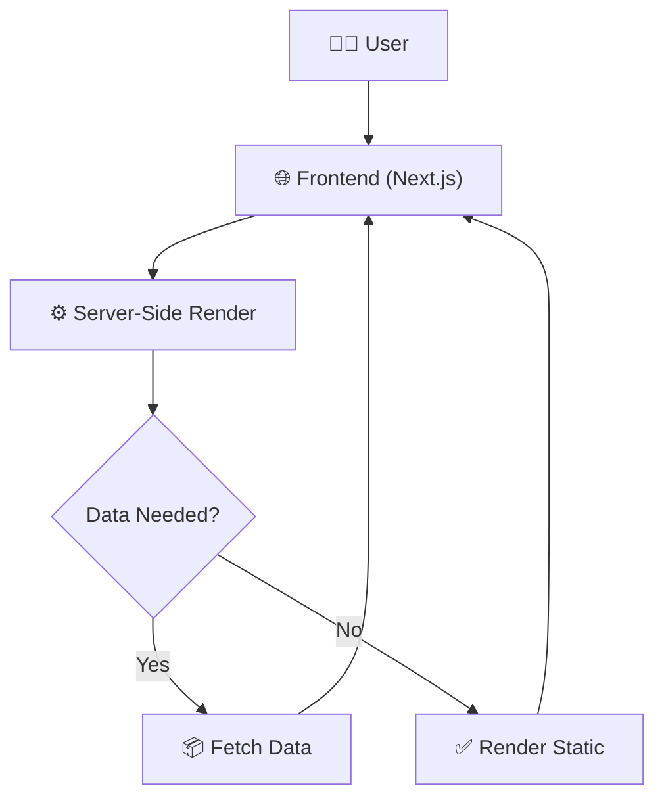

# Dashboard

*An elegant, component‑rich marketing site built with Next.js and React.*

## Description

The **Dashboard** project is a modern marketing web application powered by **Next.js 16** and **React 19**. It showcases a collection of reusable UI components—such as a responsive navbar, hero section, trust statistics, interactive demos, and integration showcases—styled with **Tailwind CSS** and enhanced with **Framer Motion** for smooth animations. The codebase follows the new Next.js app directory conventions, making it ready for server‑side rendering, static generation, and easy future extension.

## Features

✅ Responsive **Navbar** with dynamic links  
✅ Eye‑catching **Hero** section with animated call‑to‑action  
✅ **TrustStats** component to display key metrics  
✅ **AsymmetricMatrix** visualisation for data insights  
✅ **ReplayDemo** interactive demo playback  
✅ **Integrations** showcase for third‑party services  
✅ **FeaturesBento** grid layout of product features  
✅ **ArchitectureFlow** diagram component (the one you’re reading)  
✅ **DeploymentPipeline** overview component  
✅ FAQ accordion for common questions  
✅ Accessible **Footer** with navigation and socials  

## Tech Stack

- **Next.js** 16 – React framework with server‑side rendering & static generation  
- **React** 19 – UI library for component composition  
- **Tailwind CSS** 4 – Utility‑first styling  
- **Framer Motion** 12 – Animation library  
- **TypeScript** 5 – Strongly typed JavaScript  
- **Lucide‑react** – Icon set  
- **clsx** – Conditional className helper  
- **@fontsource/google-sans** – Google Sans font  


## ⚙️ How It Works



## Installation

1. **Clone the repository**  
   ```bash
   git clone <repository-url>
   cd dashboard
   ```

2. **Install dependencies**  
   ```bash
   npm install
   # or
   yarn install
   # or
   pnpm install
   # or
   bun install
   ```

3. **Run the development server**  
   ```bash
   npm run dev
   # or
   yarn dev
   ```

4. Open your browser at **http://localhost:3000** to see the app.

You're all set — the service is now running.

## Usage

- **Development**: `npm run dev` (or the equivalent Yarn/Pnpm/Bun command) watches files and hot‑reloads the site.  
- **Build for production**: `npm run build` generates an optimized production build in the `.next` folder.  
- **Start production server**: `npm start` runs the compiled app.  
- **Linting**: `npm run lint` checks code quality with ESLint.  

Customize the marketing pages by editing the components under `app/(marketing)/` and the associated UI components in `components/marketing/`.

## Contributors

- **Parth308** – Thank you for bootstrapping the project and laying down the solid Next.js foundation that powers this dashboard.