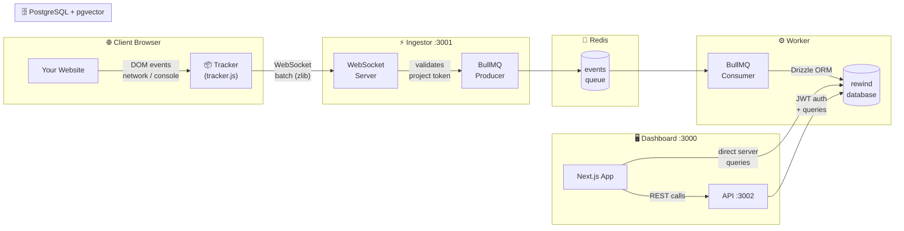
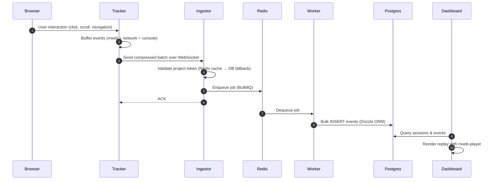

<div align="center">

<br/>

# ◗ Rewind

### *You can't fix what you can't see.*

**The open-source session replay & analytics engine built for teams who refuse to guess.**

<br/>

[](#)
[](#)
[](#)
[](#)
[](#)
[](#)
[](#)
[](#)

<br/>

> *Drop a single `<script>` tag. Get full DOM replay, API network logs, console capture, AI summaries, and conversion funnels — all running on your own server.*

<br/>

</div>

---

## Stop Guessing. Start Watching.

Your users are hitting bugs you'll never reproduce in a staging environment. They're rage-clicking on broken UI, abandoning carts on the checkout page, getting 500s from an API call that "works fine locally." They file a vague support ticket and you're left staring at logs, writing `console.log` statements, and asking them to record a screen share.

**Rewind ends that cycle.**

A 2-line `<script>` tag gives you a time machine for every user session. Watch exactly what they saw, click-by-click, with a synchronized panel showing every network request, console error, and custom event that fired during that moment. Query sessions with natural language. Generate AI support briefs in one click. Build funnels and watch the sessions of users who dropped off.

It's self-hosted. Your data never leaves your servers. It costs you a $5 VPS.

---

<p align="center">
  <a href="#features">Features</a> •
  <a href="#system-architecture">Architecture</a> •
  <a href="https://rewind-parth308.vercel.app/docs">Documentation</a> •
  <a href="#one-click-deploy--production">Deployment</a>
</p>

## 📖 Live Documentation & Demo

The complete, interactive documentation and a preview of the dashboard is available live here:
**👉 [https://rewind-parth308.vercel.app/docs](https://rewind-parth308.vercel.app/docs)**

---

## Table of Contents

1. [Features](#features)
2. [Tech Stack](#tech-stack)
3. [Architecture](#system-architecture)
4. [Monorepo Structure](#monorepo-structure)
5. [One-Click Deploy](#one-click-deploy--production)
6. [Local Development](#local-development)
7. [Embedding the Tracker](#embedding-the-tracker)
8. [Tracking Custom Events](#tracking-custom-events)
9. [Conversion Funnels](#conversion-funnels)
10. [Privacy & Masking](#privacy--masking)
11. [Database Management](#database-management)
12. [Environment Variables](#environment-variables)
13. [Contributing](#contributing)

---

## Features

> **Full in-app documentation** (installation, hardware scaling, AI setup) lives at **`/docs`** once you're running.

| Category | Capability |
|:---|:---|
| 🎥 **Session Replay** | Full DOM capture via `rrweb` — mutations, inputs, scroll, resize, canvas |
| 🌐 **Network Logs** | `fetch` intercept — URL, method, status, duration, and optional request/response body capture |
| 🖥️ **Console Capture** | Captures `log`, `warn`, `error`, `info`, `debug` with precise timestamps |
| ⚡ **Transport** | WebSocket primary with HTTP batch fallback, zlib compression, automatic retry |
| 📬 **Queue** | BullMQ + Redis — decouples ingestion from storage, handles traffic bursts gracefully |
| 🗄️ **Storage** | PostgreSQL 16 (pgvector) + Drizzle ORM — type-safe, schema-first |
| 🔐 **Privacy Controls** | Per-project masking: `maskAllInputs`, custom CSS selectors, URL blocklist, API payload redaction |
| 🎬 **Replay Player** | `rrweb-player` with synchronized network + console side-panel scrubbed to playback time |
| 📊 **Analytics Dashboard** | Customisable widget grid — sessions, errors, rage clicks, custom events, and more |
| 📉 **Conversion Funnels** | Sequential URL + custom-event funnel builder with one-click drop-off replay correlation |
| 👥 **User Profiles** | CRM-style pages aggregating a user's lifetime stats, attributes, and full session history |
| 🛡️ **Team Management** | Secure owner setup, role-based access control (Admin/Viewer), and cryptographic invite links |
| 🧠 **AI Summaries** | Streaming AI support briefs for any user based on their entire recorded history |
| 🔍 **Semantic Search** | pgvector hybrid search — find sessions by natural language query |
| 🐳 **One-Command Deploy** | Multi-stage Dockerfile + `docker-compose.prod.yml` — full stack up in one command |

---

## Tech Stack

```
Runtime        Node.js 20 + TypeScript 5
Monorepo       Turborepo · pnpm workspaces
Dashboard      Next.js 15 (App Router) · React 19 · Framer Motion
API            Express 4 · JWT (jsonwebtoken) · Zod
Ingestor       Express 4 · ws (WebSocket) · zlib compression
Worker         BullMQ consumers · Drizzle ORM
Database       PostgreSQL 16 (pgvector) · Drizzle ORM
Queue          BullMQ · ioredis · Redis 7
Recording      rrweb · rrweb-player
Tracker build  esbuild → single IIFE bundle (~12 kB gzipped)
Containers     Docker multi-stage · docker-compose
```

---

## System Architecture

### End-to-End Data Flow



### Request Lifecycle



---

## Monorepo Structure

```
rewind/
├── apps/
│   ├── tracker/          # Vanilla JS snippet  →  dist/tracker.js  (~12 kB gz)
│   ├── ingestor/         # Express + WebSocket ingestion gateway    [port 3001]
│   ├── worker/           # BullMQ consumer — persists events to DB
│   ├── api/              # REST API (auth, projects, sessions)       [port 3002]
│   └── dashboard/        # Next.js 15 dashboard + docs              [port 3000]
│
├── packages/
│   └── shared/           # Drizzle schema + Zod validators (shared source of truth)
│
├── Dockerfile                  # Multi-stage build (builder → lean runner, non-root user)
├── docker-compose.yml          # Local dev databases only (Postgres :5433, Redis :6379)
├── docker-compose.prod.yml     # Full production stack — one command to rule them all
├── turbo.json                  # Turborepo task graph
├── pnpm-workspace.yaml         # pnpm workspace config
└── .env.example                # Reference environment file with inline docs
```

---

## One-Click Deploy — Production

> **Requirements:** A server with Docker + Docker Compose installed. Nothing else.

This is the entire deployment process for a fresh VPS:

```bash
# 1. Clone
git clone https://github.com/Parth308/rewind.git && cd rewind

# 2. Configure — this is the only step that requires your attention
cp .env.example .env
# Open .env and set:
#   JWT_SECRET=<run: openssl rand -hex 32>
#   FRONTEND_URL=https://your-domain.com
#   NEXT_PUBLIC_INGESTOR_URL=wss://your-ingestor-domain.com
#   (optional) GOOGLE_GENERATIVE_AI_API_KEY, OPENAI_API_KEY, etc.

# 3. Build images and launch the full stack
docker compose -f docker-compose.prod.yml up --build -d

# 4. First run only — push the database schema
docker compose -f docker-compose.prod.yml exec api pnpm run db:push

# Done. 🎉
```

All services start automatically after reboot (`restart: unless-stopped`). Postgres and Redis have health checks — app containers wait for them to be healthy before starting.

### What's running after deploy

| Service | Port | Description |
|:---|:---|:---|
| **Dashboard** | `3000` | Main UI — sessions, replay, funnels, AI search |
| **Ingestor** | `3001` | WebSocket + HTTP endpoint for the tracker |
| **API** | `3002` | REST API for the dashboard (internal only) |
| **Postgres** | `5433` (host) | pgvector-enabled PostgreSQL 16 |
| **Redis** | `6379` (host) | Queue + config cache |

> All services communicate over a private `rewind-internal` Docker bridge network. Only the ports above are exposed to the host.

### Updating to a new version

```bash
git pull
docker compose -f docker-compose.prod.yml up --build -d
# If the schema changed:
docker compose -f docker-compose.prod.yml exec api pnpm run db:push
```

### Recommended: Put a Reverse Proxy in Front

For HTTPS and clean domains, point **Nginx** or **Caddy** at the ports above. Example Caddyfile:

```
rewind.yourdomain.com {
    reverse_proxy localhost:3000
}

ingest.yourdomain.com {
    reverse_proxy localhost:3001
}
```

---

## Local Development

Run all services locally with hot-reloading. Docker is only used for the databases.

### Prerequisites

- [Node.js 20+](https://nodejs.org)
- [pnpm 9+](https://pnpm.io) — `npm i -g pnpm`
- [Docker Desktop](https://www.docker.com/products/docker-desktop/)

```bash
# 1. Clone
git clone https://github.com/Parth308/rewind.git && cd rewind

# 2. Environment
cp .env.example .env
#    Defaults work out of the box for local development.

# 3. Install workspace dependencies
pnpm install

# 4. Start Postgres (port 5433) and Redis (port 6379)
docker compose up -d

# 5. Push the database schema
pnpm run db:push

# 6. Build the Tracker (once, or after tracker source changes)
cd apps/tracker && pnpm install && pnpm run build && cd ../..

# 7. Start all services with hot-reloading
pnpm run dev
```

| Service | URL |
|:---|:---|
| Dashboard | http://localhost:3000 |
| Ingestor | http://localhost:3001 |
| API | http://localhost:3002 |
| Postgres | `localhost:5433` |
| Redis | `localhost:6379` |

---

## Embedding the Tracker

The Ingestor serves two auto-generated scripts:
- `/tracker/tracker.js` — the recording bundle
- `/config/<TOKEN>.js` — your project's privacy config, loaded first so the tracker knows what to mask before it records a single byte

### Plain HTML

```html
<script src="https://ingest.yourdomain.com/config/YOUR_PROJECT_TOKEN.js"></script>
<script src="https://ingest.yourdomain.com/tracker/tracker.js"></script>
<script>
  window.Rewind.init({
    projectToken: 'YOUR_PROJECT_TOKEN',
    ingestorUrl:  'wss://ingest.yourdomain.com'
  });
</script>
```

### React / Vite

```tsx
// src/main.tsx (or App.tsx)
import { useEffect } from 'react';

useEffect(() => {
  const configScript = document.createElement('script');
  configScript.src = 'https://ingest.yourdomain.com/config/YOUR_PROJECT_TOKEN.js';

  configScript.onload = () => {
    const trackerScript = document.createElement('script');
    trackerScript.src = 'https://ingest.yourdomain.com/tracker/tracker.js';
    trackerScript.onload = () => {
      (window as any).Rewind.init({
        projectToken: 'YOUR_PROJECT_TOKEN',
        ingestorUrl:  'wss://ingest.yourdomain.com',
      });
    };
    document.head.appendChild(trackerScript);
  };

  document.head.appendChild(configScript);
}, []);
```

### Next.js (App Router)

```tsx
// app/layout.tsx
import Script from 'next/script';

export default function RootLayout({ children }: { children: React.ReactNode }) {
  return (
    <html>
      <body>
        {children}
        <Script src="https://ingest.yourdomain.com/config/YOUR_PROJECT_TOKEN.js" strategy="beforeInteractive" />
        <Script
          src="https://ingest.yourdomain.com/tracker/tracker.js"
          strategy="afterInteractive"
          onLoad={() => {
            (window as any).Rewind.init({
              projectToken: 'YOUR_PROJECT_TOKEN',
              ingestorUrl:  'wss://ingest.yourdomain.com',
            });
          }}
        />
      </body>
    </html>
  );
}
```

---

## Tracking Custom Events

Instrument your product with named events that appear as **green markers on the session scrubber** — precisely synchronized with the DOM replay.

### 1. Frontend Tracking (Client-Side)

```javascript
// Track a checkout completion
window.Rewind.track('Purchase Completed', {
  orderId:  '12345',
  amount:   99.99,
  currency: 'USD',
});

// Track a feature used
window.Rewind.track('Export Triggered', { format: 'csv', rows: 4200 });
```

### 2. Backend Tracking (Node.js SDK)

## 🧩 SDKs & Integrations

- **Frontend Tracker:** `@rewind/tracker`
- **Node.js SDK:** `rewind-node`

```bash
npm install rewind-node
```

Session replay is strictly visual, but many critical failures happen purely on the backend. You can use the `rewind-node` SDK to push backend context, errors, and user identities directly into the active user's session timeline!

1. Pass `window.Rewind.sessionId` from your frontend to your backend (e.g., via an `x-rewind-session-id` HTTP header).
2. Initialize the SDK in your API and push the events:

```typescript
import { Rewind, expressMiddleware } from 'rewind-node';
import express from 'express';

const rewind = new Rewind({
  projectToken: 'YOUR_PROJECT_TOKEN',
  ingestorUrl: 'https://ingest.yourdomain.com' // Omit for local development
});

const app = express();

// 1. Using the Express Middleware (Easiest!)
// This automatically extracts the x-rewind-session-id header 
// and injects `req.rewind` into all your endpoints.
app.use(rewind.expressMiddleware());

app.post('/checkout', async (req, res) => {
  try {
    // Identify the user on the session
    await req.rewind.identify('user-123', { plan: 'pro' });

    // Track custom business events
    await req.rewind.track('Payment Succeeded', { amount: 99 });
    
    res.json({ success: true });
  } catch (error) {
    // 2. Capturing Backend Exceptions
    // This pushes the raw error to the frontend session replay as a console.error!
    await req.rewind.captureException(error, { route: '/checkout' });
    
    res.status(500).send('Error');
  }
});
```

#### Manual Usage

If you aren't using Express, you can manually orchestrate these calls by passing the `sessionId`:

```typescript
// Track a custom event
await rewind.track(sessionId, 'Order Shipped', { orderId: '123' });

// Identify the session
await rewind.identify(sessionId, 'user-123', { email: 'user@test.com' });

// Capture a server-side exception
await rewind.captureException(sessionId, new Error('Database timeout'), { query: 'SELECT *' });
```

Custom events are stored as `jsonb` payloads. They power the funnel builder and appear in the session's Events tab, enriching every replay with your backend business context. Exceptions captured via `captureException` will appear seamlessly alongside the frontend browser logs in the session replay.

---

## Conversion Funnels

Build a funnel. Watch it bleed. Fix it.

The visual funnel builder lets you chain **URL visits** and **Custom Events** into sequential flows. At each step, you see the exact conversion rate and drop-off count. Click any step's drop-off number to instantly load a filtered replay list — watch exactly why users abandoned that flow.

- **Step-by-step drop-off analysis** with user counts
- **One-click drop-off replay** — go from funnel data to watching the session in seconds
- **Saved funnels** — bookmark your critical flows for recurring monitoring

---

## Privacy & Masking

Rewind is private by design. Every setting is per-project and takes effect immediately — no redeploy needed.

| Setting | Default | Description |
|:---|:---|:---|
| **Mask Inputs** | ✅ On | Replaces all `<input>` values with `***` before recording |
| **Mask Selectors** | — | CSS selectors — text inside matched elements is blurred |
| **Block Selectors** | — | CSS selectors — matched elements are fully hidden from the recording |
| **Ignore URLs** | — | URL patterns — recording pauses on matching pages |
| **Capture API Payloads** | ❌ Off | Opt-in to record `fetch` request/response bodies |
| **Redacted JSON Keys** | — | Keys to scrub from JSON payloads in the browser (e.g. `password, token`) — values are replaced with `[REDACTED]` *before* transmission |

> API payload masking happens **in the browser**, not on the server. Sensitive values are never transmitted.

---

## Database Management

All schema changes live in `packages/shared/src/schema.ts`. Drizzle handles migrations.

```bash
# Apply schema changes
pnpm run db:push

# Generate versioned SQL migration files (for audit trails)
pnpm run db:generate

# Open Drizzle Studio — visual DB browser
cd packages/shared && npx drizzle-kit studio
```

---

## Environment Variables

| Variable | Default | Required | Description |
|:---|:---|:---|:---|
| `DATABASE_URL` | — | ✅ | PostgreSQL connection string |
| `REDIS_URL` | — | ✅ | Redis connection string |
| `JWT_SECRET` | — | ✅ | Secret for signing JWTs. Use `openssl rand -hex 32` |
| `FRONTEND_URL` | `http://localhost:3000` | ✅ | Dashboard URL (used for CORS) |
| `API_URL` | `http://api:3002` | ✅ | API URL as seen from the Dashboard container |
| `NEXT_PUBLIC_INGESTOR_URL` | `ws://localhost:3001` | ✅ | Public WebSocket URL embedded in the tracker snippet |
| `PORT` | `3002` | — | Port for the REST API |
| `INGESTOR_PORT` | `3001` | — | Port for the Ingestor |
| `AI_PROVIDER` | `google` | — | `google` \| `openai` \| `anthropic` |
| `GOOGLE_GENERATIVE_AI_API_KEY` | — | — | For Gemini-powered AI features |
| `OPENAI_API_KEY` | — | — | For GPT-4 / text-embedding-3 |
| `ANTHROPIC_API_KEY` | — | — | For Claude 3 |

> **Local dev:** Use `localhost` hostnames. **Production Docker:** Use service names — `postgres`, `redis`, `api`.

---

## Contributing

1. Fork the repository and create a feature branch: `git checkout -b feat/your-feature`
2. Install dependencies: `pnpm install`
3. Make your changes — keep commits small and descriptive.
4. Run the linter: `pnpm run lint`
5. Open a Pull Request with a clear description of what changed and why.

---

<div align="center">

<br/>

*Built to give small teams the observability superpowers that used to cost $1,000/month.*

<br/>

Made with ❤️ by **[Parth308](https://github.com/Parth308)**

</div>